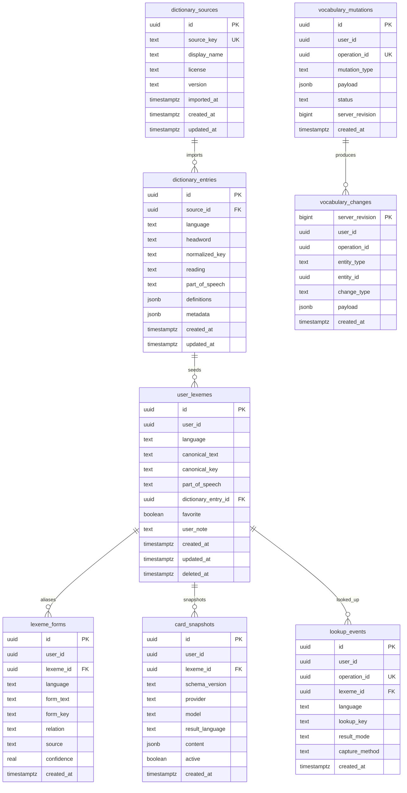

# Supabase Vocabulary Schema

This document describes the initial Supabase schema created by
`supabase/migrations/202605310001_initial_vocabulary_schema.sql`.

The current deployment is a personal-use sync backend. Every exposed table has
RLS enabled, and the initial policies allow only authenticated users whose JWT
contains `app_metadata.admin = true`. User-owned rows also require
`user_id = auth.uid()` so the policies can later move to normal owner-scoped
multi-user access without reshaping the tables.



## Table Roles

- `dictionary_sources`: global dictionary source metadata such as EJDict version
  and license.
- `dictionary_entries`: global dictionary entries imported from a source. User
  vocabulary writes must not mutate these rows.
- `user_lexemes`: user-owned canonical vocabulary items, keyed by
  `(user_id, language, canonical_key)`.
- `lexeme_forms`: observed or inferred aliases for a lexeme. Inflected forms
  such as `went` should point at canonical lexemes such as `go` instead of
  becoming separate cards.
- `card_snapshots`: versioned structured result snapshots. Regeneration should
  add a new snapshot instead of silently overwriting user state.
- `lookup_events`: append-only lookup records identified by client-generated
  `operation_id` for idempotency.
- `vocabulary_mutations`: accepted mutation records used by the sync layer.
- `vocabulary_changes`: server revision stream for pull-based sync.

## RLS Model

The helper function is:

```sql
public.lexi_is_admin()
```

It returns true only when:

- the JWT role is `authenticated`;
- `auth.jwt() -> 'app_metadata' ->> 'admin'` is `true`.

Global dictionary tables require only `lexi_is_admin()`. User-owned tables
require both:

```sql
public.lexi_is_admin() and user_id = auth.uid()
```

When Lexi is ready for normal multi-user access, the user-owned table policies
can be relaxed to:

```sql
user_id = auth.uid()
```

## Sync RPCs

Migration `202605310002_vocabulary_sync_rpcs.sql` adds:

- `apply_vocabulary_mutation(envelope jsonb)` — idempotent push for `save_card_snapshot`
- `pull_vocabulary_changes(since_revision bigint, batch_limit int)` — revision-based pull stream

Both RPCs require an authenticated admin JWT and operate on rows scoped by
`auth.uid()`.

## Privacy Boundary

The schema stores validated structured vocabulary data and explicit user state.
It does not include columns for raw selected text, raw prompts, raw provider
responses, API keys, or clipboard contents.
