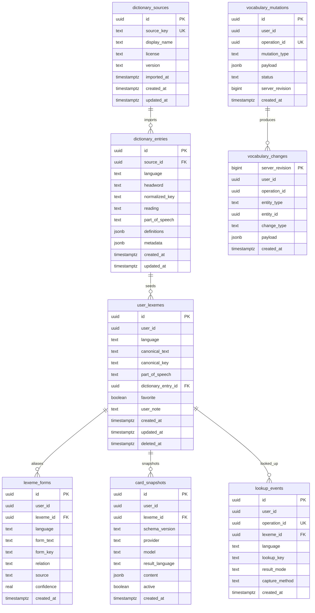

# Supabase Vocabulary Schema

This document describes the initial Supabase schema created by
`supabase/migrations/202605310001_initial_vocabulary_schema.sql`.

The current deployment is a personal-use sync backend. Every exposed table has
RLS enabled, and the initial policies allow only authenticated users whose JWT
contains `app_metadata.admin = true`. User-owned rows also require
`user_id = auth.uid()` so the policies can later move to normal owner-scoped
multi-user access without reshaping the tables.



## Table Roles

### Canonical vocabulary (active in desktop sync)

- `user_lexemes`: user-owned canonical vocabulary items, keyed by
  `(user_id, language, canonical_key)`. Supabase is the account source of truth;
  SQLite is the device read replica used for popup lookup.
- `lexeme_forms`: observed or inferred aliases for a lexeme. Inflected forms
  such as `went` should point at canonical lexemes such as `go` instead of
  becoming separate cards.
- `card_snapshots`: versioned structured result snapshots. Regeneration should
  add a new snapshot instead of silently overwriting user state.
- `vocabulary_mutations`: accepted mutation records used by the sync push layer.
- `vocabulary_changes`: server revision stream for incremental pull after the
  initial bootstrap copy.

### Reserved / not used by current desktop sync

- `dictionary_sources`: global dictionary source metadata such as EJDict version
  and license. Not part of the current vocabulary bootstrap or popup sync path.
- `dictionary_entries`: global dictionary entries imported from a source. User
  vocabulary writes must not mutate these rows.
- `lookup_events`: append-only lookup records. The current desktop client does not
  write or read this table in the main sync/lookup flow.

## RLS Model

The helper function is:

```sql
public.lexi_is_admin()
```

It returns true only when:

- the JWT role is `authenticated`;
- `auth.jwt() -> 'app_metadata' ->> 'admin'` is `true`.

Global dictionary tables require only `lexi_is_admin()`. User-owned tables
require both:

```sql
public.lexi_is_admin() and user_id = auth.uid()
```

When Lexi is ready for normal multi-user access, the user-owned table policies
can be relaxed to:

```sql
user_id = auth.uid()
```

## Sync RPCs

Migration `202605310002_vocabulary_sync_rpcs.sql` adds:

- `apply_vocabulary_mutation(envelope jsonb)` — idempotent push for `save_card_snapshot`
- `pull_vocabulary_changes(since_revision bigint, batch_limit int)` — revision-based pull stream

Migration `202605310004_backfill_lexeme_forms.sql` repairs **existing Supabase rows**
where `user_lexemes` and `card_snapshots` exist but `lexeme_forms` is incomplete:

- inserts missing `canonical` rows from `user_lexemes.canonical_text` / `canonical_key`
- inserts missing `irregular` rows from active `card_snapshots.content.inflections`
- idempotent (`on conflict do update`); safe to re-run

Migration `202605310005_apply_mutation_ensure_lexeme_forms.sql` updates
`apply_vocabulary_mutation` so **future** saves always write:

- a `canonical` alias for the lexeme
- `irregular` aliases from `content.inflections`
- any explicit `payload.forms` entries (unchanged)

Deploy both `004` and `005` on the Supabase project before expecting lookup aliases
to be complete server-side.

### After deploying the backfill on Supabase

1. Apply migrations `004` and `005` (`supabase db push` or SQL editor).
2. Verify counts, for example:

```sql
-- lexemes without a canonical alias (should be 0)
select count(*)
from public.user_lexemes ul
where ul.deleted_at is null
  and not exists (
    select 1
    from public.lexeme_forms lf
    where lf.lexeme_id = ul.id
      and lf.relation = 'canonical'
      and lf.form_key = ul.canonical_key
  );

-- go should have went irregular when the active card lists it
select ul.canonical_key, lf.form_key, lf.relation
from public.user_lexemes ul
join public.lexeme_forms lf on lf.lexeme_id = ul.id
where ul.canonical_key = 'go'
order by lf.relation, lf.form_key;
```

3. **Desktop SQLite replicas** that already completed bootstrap still hold the old
   `lexeme_forms` copy. Incremental pull does not replay backfilled rows (no new
   `vocabulary_changes` entries). Reset bootstrap on the device so the next sync
   re-downloads `lexeme_forms` from Supabase, for example by deleting the bootstrap
   scope row in local `sync_state` (`vocabulary_bootstrap:<user_id>`) or clearing
   the vocabulary SQLite file under app data.

Migration `202605310003_lookup_vocabulary_card.sql` adds:

- `lookup_vocabulary_card(...)` — optional RPC for on-demand remote lookup. The
  desktop client does not use this in the main path; it bootstraps
  `user_lexemes`, `lexeme_forms`, and `card_snapshots` into SQLite and reads
  locally for popup lookup.

All sync RPCs require an authenticated admin JWT and operate on rows scoped by
`auth.uid()`.

## Privacy Boundary

The schema stores validated structured vocabulary data and explicit user state.
It does not include columns for raw selected text, raw prompts, raw provider
responses, API keys, or clipboard contents.
